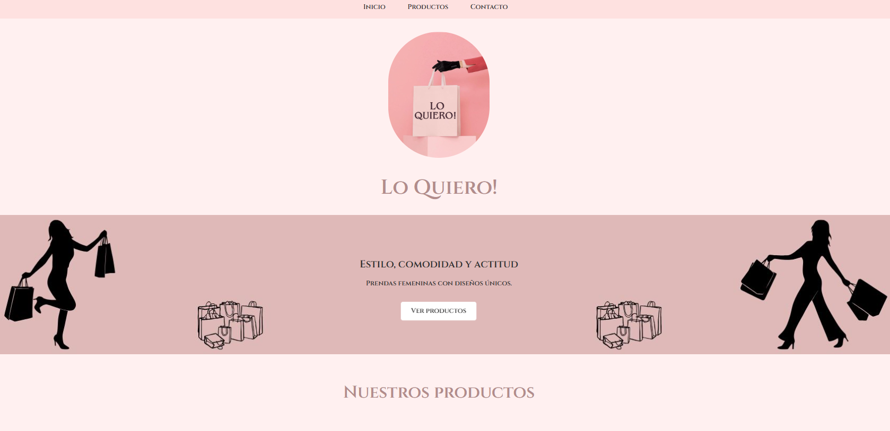
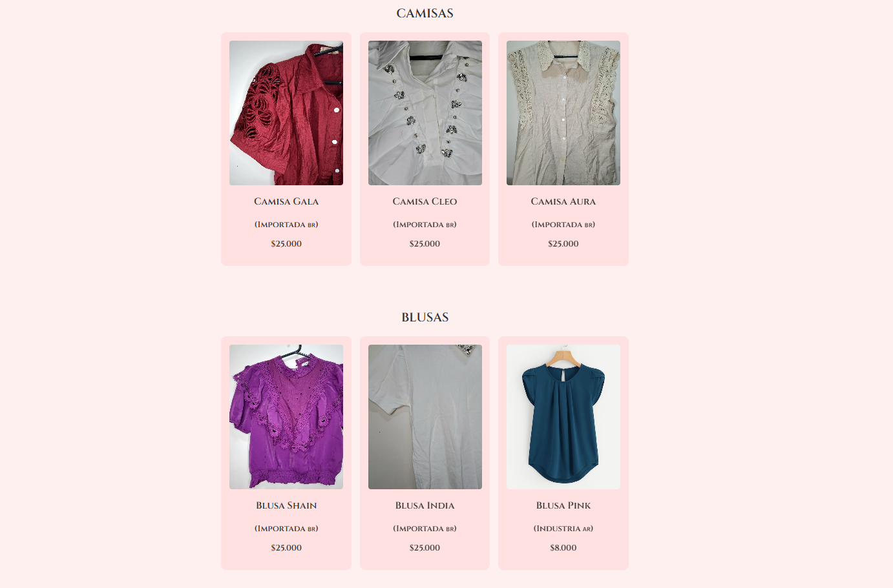

# LO QUIERO!

Página web estática desarrollada con **HTML y CSS**, publicada mediante **GitHub Pages**.

El proyecto simula el sitio web de una **tienda de ropa**, mostrando productos, precios y secciones informativas, con un enfoque en el diseño visual y la estructura del contenido.

---

## 🌐 Demo

👉 https://wsebastianpds.github.io/

---

## 🎯 Objetivo del proyecto

- Practicar desarrollo **frontend básico**
- Diseñar una página web clara y visualmente atractiva
- Simular la presentación de productos de una tienda
- Publicar un proyecto real utilizando GitHub Pages

---

## 🧩 Descripción

La aplicación es una **landing page estática** que incluye:

- Sección de inicio
- Presentación de productos
- Imágenes y precios
- Estilos personalizados
- Navegación simple

El proyecto fue desarrollado **desde cero**, sin frameworks, priorizando la comprensión de **HTML semántico** y **CSS**.

---

## 🛠️ Tecnologías utilizadas

- HTML5
- CSS
- JavaScript
- GitHub Pages

---

## 📂 Estructura del proyecto
/

├── index.html

├── styles.css

├── script.js

├── img/

└── README.md

---

## 📸 Captura de pantalla

  

  

---

## 📌 Estado del proyecto

✔️ Proyecto finalizado 

✔️ Funcional  

✔️ Publicado online  

---

## 👤 Autor

**William Sebastian Pinto Da Silva**  
Junior Backend Developer | C# · .NET · SQL | QA Testing

---

> Proyecto personal con fines educativos y de práctica.

